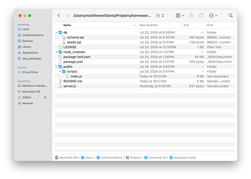
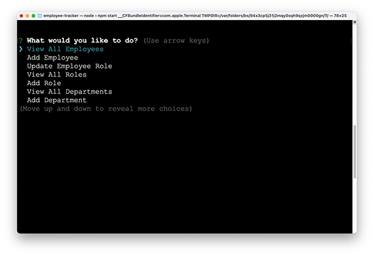

# Employee Tracker

## License

MIT License

## Description
This app gives users the ability to track employees. It's functions include viewing the current employee names, the current list of roles available for employees to fill, and the current list of departments in the company. It also allows users to add employees, roles, and departments and to modify employee roles. Features that might be added include the ability to reassign employees to other departments and to delete employees, roles, and departments.

## Table of Contents
- [Installation](#installation)
- [Usage](#usage)
- [License](#license)
- [Contributing](#contributing)
- [Tests](#tests)
- [Questions](#questions)

## Installation
To install Employee Tracker, download the repository ensuring that all the file and folder names remain unchanged and in their original locations as shown in the screen shot below. To install dependencies such as Inquirer (version 8.2.4), on which Employee Tracker relies, type "npm install" from the folder where server.js resides.

## Usage
To use Employee Tracker, type "npm start" in the terminal from the folder where server.js resides. Users will be offered a list of actions they can take; they navigate through the list using the arrow keys on their keyboards. Hitting the enter key will select the action. For the three actions that provide current lists, the information requested will appear immediately in the terminal. For the remaing actions, users are prompted for additional information. The action requested will be completed when the additional information is provided, and a notification that the action has been completed will appear in the terminal. To see a video of the application in action, click on the screen capture below. Note: Depending on the environment in which you're viewing this README file, you may not be able to view the video online, in which case, you should be able to download the video and view it locally.

## Contributing
To contribute to Employee Tracker, clone this repository locally and commit your code to a separate branch.

## Tests
If you are making core library changes, please write unit tests for your code and ensure that everything is working correctly before opening a pull request.

## Questions
You can see my github repositories at [MatthewWilliamsCMH](https://github.com/MatthewWilliamsCMH/).  
Drop me a line at [matthewwilliamscmh@icloud.com](mailto:matthewwilliamscmh@icloud.com).